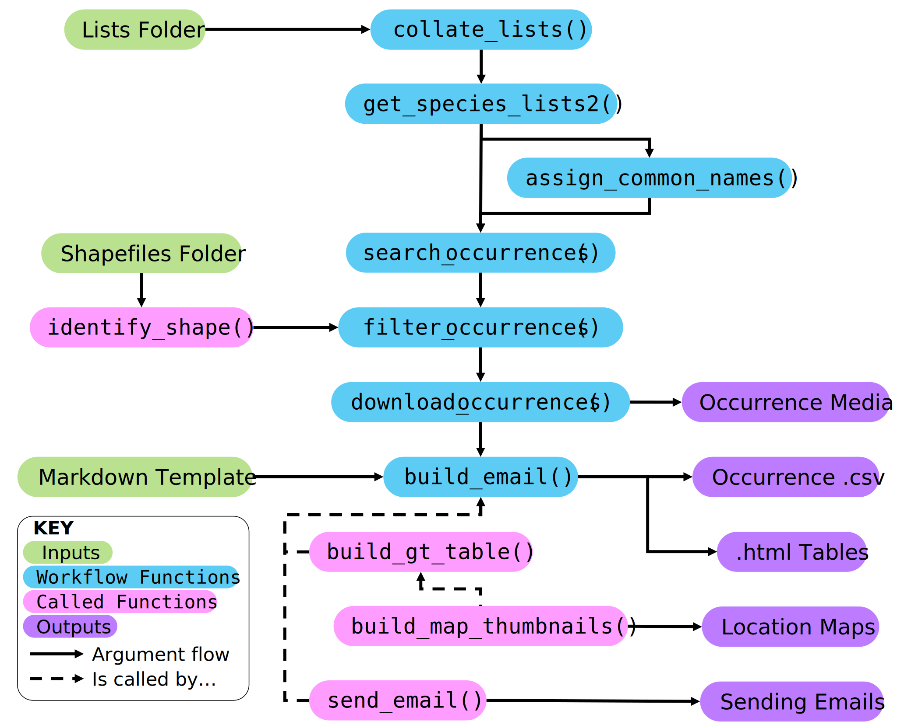

# koel

R package for sending email alerts for biodiversity queries

------------------------------------------------------------------------

`koel` is an R package created to facilitate the producing and sending of email alerts for biosecurity (and other) purposes pertaining to biodiversity data hosted by 'living atlases' such as the Atlas of Living Australia (ALA). It is structured around the use of the R package `galah`, which enables direct interfaces with these biodiversity databases and their records. Currently, `koel` is only supported to interact with the ALA. Like `galah`, `koel` is produced and maintained by the Science & Decision Support Team at the ALA.

`koel` comprises a small number of functions that interact within a clear workflow to take a folder containing .csv files of species lists and produce/send informative emails summarising occurrences of species on these lists from some pre-determined time-frame. These functions may be utilised externally of the recommended/intended workflow, however due to the rigid nature of taxonomic conventions and output from `galah` it is suggested that the workflow is followed until a good understanding of the inputs and outputs is obtained.

------------------------------------------------------------------------

### Installation

`koel` is not currently on CRAN and so must be installed from github. This can be done as follows:

```{r Koel Installation, eval = FALSE}
install.packages("remotes")
remotes::install_github("atlasoflivingaustralia/koel")
```

```{r Install Packages, include = FALSE}
#install.packages("galah")
#install.packages("DiagrammeR")
#install.packages("gt")
#install.packages("tidyverse")

library(galah)
library(DiagrammeR)
library(gt)
library(tidyverse)
```

------------------------------------------------------------------------

### Workflow

The general workflow of the functions in `koel` will be described here along with inputs an outputs, however more detailed descriptions are provided in individual function documentations.

To begin, the user must possess at least one list of species of interest compiled as a .csv with at least four key columns, namely `"correct_name", "provided_name", "synonyms", "common_name"`., and any of three optional columns named `"state", "lga", "shape"`. Each row represents a single species. Further information regarding the formatting of these columns is provided below. The names of the list .csv files are important and should be unique, as they form the basis of the workflow formatting.

The function workflow from .csv list files through to sending of emails is summarised by the below diagram.



```{r Workflow Diagram, echo = FALSE}
# nodes <- create_node_df(
#   n = 10,
#   type = "lower",
#   label = c("lists csv folder", "collate_lists()", "get_species_lists2()",
#             "assign_common_names()", "lookup_species_counts()",
#             "download_records()", "build_email()",
#             "build_gt_tables()", "build_map_thumbnail()", "send_email()"),
#   color = "cyan"
# )
# edges <- create_edge_df(
#   from = c(1, 2, 3, 3, 4, 5, 6),
#   to = c(2, 3, 4, 5, 6, 6, 7),
#   colour = "black"
# )
# 
# graph <- create_graph(nodes_df = nodes, edges_df = edges)
# graph |> render_graph()
```

Importantly, the key inputs for the workflow are 1) a folder containing similarly named and formatted .csv files of species lists., and 2) the R markdown template used for visualising the output of `build_gt_table()`. If lists require shapefile filtering then an additional folder of shape files must be provided.

The recommended workflow follows the calling of the five blue functions which pass their dataframe/tibble outputs to each other. `collate_lists()` summarises the list names and paths for import and tidying with `get_species_lists2()`. `assign_common_names()` then summarises duplicate common names. The outputs pass through `search_occurrences()`, `filter_occurrences()` and `download_occurrences()` which search, filter and download occurrence data and media respectively. `build_email()` is the final function called in the workflow, and facilitates the creation and sending of biosecurity alert emails to and from pre-specified email addresses. Output files are saved at various stages throughout the workflow in specified cache and/or output paths.

#### Email sending

Emails are sent using the R package `{emayili}` and require the provision of an email address and password in the `build_email()` and `send_email()` functions. Currently there is only support for emails such as the official ALA biosecurity alerts email which can be interfaced with the `emayili::server()` function by way of the `host` and `port` arguments.

The email sending functions utilise an R Markdown template to create a summary document of all species occurrences. This template should be created and saved by the user in the working directory prior to use of the function. `build_email()` requests an argument specifying the path to the template and renders + saves the .Rmd file in-line. The object provided to the template is a data.frame named `table_df` and we recommended using package `{gt}` to render the dataframe.

`table_df` consists of one row per row occurrence, and four columns (`species`, `observation`, `location`, `image`) of html code referencing data and media related to each occurrence. A recommended output style within the markdown using `{gt}` may look something like this:

```{r .Rmd Template, eval = FALSE}
table_df |>
  gt::gt() |>
  gt::cols_label(
    species = "Species",
    observation = "Observation",
    location = "Location",
    image = "Image"
  ) |>
  gt::cols_align(align = c("left"), columns = everything()) |>
  gt::tab_options(table.width = pct(90))
```

`build_email()` requires the provision of a data.frame for the `email_list` argument. However, if the user wishes to simply save the .html occurrence tables than the `email_list` argument can be provided as an empty dataframe with the necessary columns i.e. `email_list <- data.frame(email = character(), list = character())`. By then specifying an output folder path (default value of `output_path` argument is `NULL`, the rendered markdown files will be saved to that directory without sending any emails.

#### List Formatting

The following points outline the key columns required for provided species lists to proceed through the entire workflow. All lists should be stored in the same directory with no other files.

-   `"correct_name"` is the accepted scientific name of a species, for example `"Urodynamis taitensis"`. The correct name should not contain authorities, commas, or double spaces.

-   `"provided_name"` is the verbatim name of the species as provided for the list, e.g. `"Urodynamis taitensis (Sparrman, 1787)"`. It may be identical to the `"correct_name"` or `"common_name"`. It is not used for any searching of occurrence records.

-   `"synonyms"` is a comma-delimited (`", "`) list of additional search terms for each species e.g. `"Urodynamis taitensis belli, Cuculus taitensis, Eudynamis taitensis"`. The naming standard for `synonyms` is identical to that described for `correct_name`. If no taxonomic synonyms exist then this may be left blank.

-   `"common_name"` is the accepted common name of the species as recognised by the list provided/creator e.g. `"Long-Tailed Koel"`. If no common name exists or is known then this may be left blank.

-   `"state"` is a comma-delimited (`", "`) list of Australian state and/or territory jurisdictions to filter recorded occurrences by state for each species e.g. `"QLD, SA, NT"`. Australian state and territory abbreviations (QLD, NSW, VIC, SA, WA, NT, ACT) are used, while for Australia-wide alerts (including island territories such as Norfolk Island, Christmas Island etc.) the abbreviation should be provided as simply `"AUS"`. If the `"state"` column is left blank for a species or not provided for an entire list, then it will default to `"AUS"`.

-   `"lga"` is a comma-delimited (`", "`) list of Australian local government areas (LGAs) to filter recorded occurrences by LGA for each species e.g. `"CITY OF PERTH, KANGAROO ISLAND COUNCIL"`. All-capitalised LGA names should be provided as verbatim matches with the list as specified by layer `cl10923` in the ALA spatial portal. A full list of accepted LGA names can be found with the below code. If the `"lga"` column is left blank for a species or not provided for an entire list, then it will default to `NA`.

```{r LGA Names, eval = FALSE}
# To view all available LGA names in the ALA spatial portal

galah::search_fields("cl10923") |>
  galah::show_values() |>
  dplyr::pull(category) |>
  dplyr::sort()
```

-   `"shape"` is an optional column to provide the name of a supplied shape (.shp) file folder, which can be used to filter recorded occurrences that lie within that shape file for each species. The column entry should match verbatim the name of the folder and spatial files. If multiple feature shapes are provided in the one shape file then the name of the feature an occurrence sits in will be provided in the email table output. If the `"shape"` column is left blank for a species or not provided for an entire list, then it will default to `NA`.
