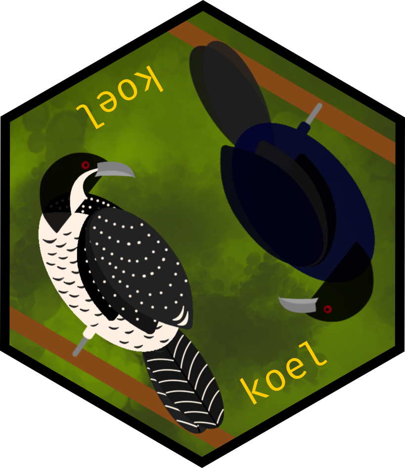
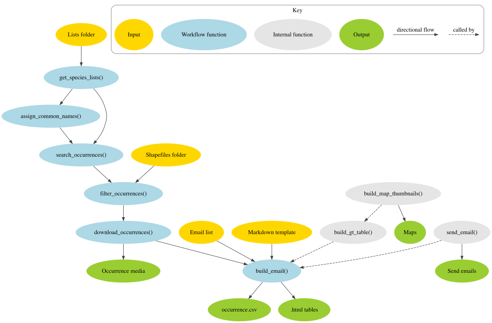

<!-- README.md is generated from README.Rmd. Please edit that file -->

# koel 

<!-- badges: start -->

[](https://www.tidyverse.org/lifecycle/#experimental)
<!-- badges: end -->

## Overview

`koel` facilitates the process of retrieving biodiversity data within
spatial and temporal constraints, summarising it in a table, and
emailing the summary table. `koel` uses
[`galah`](https://galah.ala.org.au) to query and retrieve biodiversity
data from the [Atlas of Living Australia](https://www.ala.org.au) (ALA),
and [`emayili`](https://github.com/datawookie/emayili/) to send emails
from R. `koel` is developed and maintained by the [Science and Decision
Support Team](https://labs.ala.org.au/about.html) at the ALA.

The package is named after the Eastern Koel (*Eudynamys orientalis*), a
large, canopy-dwelling cuckoo with [distinctive
calls](https://xeno-canto.org/explore?query=Eudynamys%20orientalis). The
package is named after this species because the suggested workflow is
primarily used for sending alerts, and the Eastern Koel is frequently
identified through its distinctive call before it is seen. The logo was
designed by Shandiya Balasubramaniam.

If you have any questions or suggestions, please [contact
us](mailto:support@ala.org.au).

## Installation

You can install the package from GitHub with:

``` r
install.packages("remotes")
remotes::install_github("AtlasOfLivingAustralia/koel")
```

## Suggested workflow

The figure below provides an overview of the suggested workflow when
using `koel`. Users provide a csv file containing taxon information, and
the filepath to this is passed as an argument to the first function in
the suggested workflow, `collate_lists()`. This summarises the
information provided in the species list(s), and the subsequent
functions pass the species names through a series of filtering,
checking, and downloading steps to return a tibble containing
information on the requested species.



### Taxonomic filters

Taxonomic information is provided as one or more csv files, where each
species is listed on a separate row. The following four columns must be
included: `"correct_name"`, `"provided_name"`, `"synonyms"`,
`"common_name"`

- `"correct_name"` is the accepted scientific name of a species
  e.g. `"Urodynamis taitensis"`. The correct name should not contain
  authorities, commas, or double spaces.

- `"provided_name"` is the verbatim name of the species as provided for
  the list e.g. `"Urodynamis taitensis (Sparrman, 1787)"`. It is not
  used when searching for species occurrences and may be identical to
  `"correct_name"` or `"common_name"`.

- `"synonyms"` is a comma-delimited string of additional search terms
  for each species
  e.g. `"Urodynamis taitensis belli, Cuculus taitensis, Eudynamis taitensis"`.
  The naming convention for `synonyms` is identical to that described
  for `correct_name`. This field may be left blank.

- `"common_name"` is the common name of the species
  e.g. `"Long-Tailed Koel"`. This field may be left blank.

It is possible to exclude alerts for certain species from a genus, or
subspecies from a species; this may be practical where users do not
require alerts for taxa that are known to be native or established in an
area. In this instance, each taxon to be excluded should be provided in
a separate row, prefixed with an exclamation point (!) in
`provided_name`. For example, to receive alerts for all *Trichoglossus*
except the Rainbow Lorikeet (*Trichoglossus haematodus*):

     correct_name               provided_name               synonyms common_name     
     "Trichoglossus"            "Trichoglossus"             NA       "Lorikeets"       
     "Trichoglossus haematodus" "!Trichoglossus haematodus" NA       "Rainbow Lorikeet"

### Spatial filters

By default, `koel` retrieves Australia-wide species occurrence records
from the ALA. It is possible to limit records to particular spatial
regions using any of the following optional columns in the provided csv
files: `"state"`, `"lga"`, `"shape"`

- `"state"` is a comma-delimited string of Australian states and/or
  territories e.g. `"QLD, SA, NT"`. Standard upper case initialisms,
  abbreviations, and contractions (QLD, NSW, VIC, SA, WA, NT, ACT) are
  used. If the abbreviation `"AUS"` is provided, or if this field is
  left blank, no state-based spatial filters will be applied. This may
  be useful if it is necessary to search for records from island
  territories e.g. Norfolk Island, Christmas Island.

- `"lga"` is a comma-delimited string of Australian local government
  areas (LGAs), provided in upper case
  e.g. `"CITY OF PERTH, KANGAROO ISLAND COUNCIL"`. The full list of LGA
  names is available through the ALA as a contextual layer (cl10923).
  This may be accessed through the [spatial
  portal](https://spatial.ala.org.au) or using the `galah` package:

``` r
galah::search_fields("cl10923") |>
  galah::show_values()
```

- `"shape"` is the filepath to a shapefile (.shp) within a directory
  containing other associated metadata (e.g. .shx, .dbf, .prj). Multiple
  feature shapes may be provided within a single shapefile. Records will
  be filtered to those falling within the shapefile(s). Where multiple
  feature shapes are provided, the name of the feature matching to the
  record location will be provided in the final HTML table.

### Sending an email

The email summarising the results of this workflow contains a table with
information on each species of interest, a map thumbnail of record
location, and an image (if available) of each species.

To produce the HTML file containing the table and send this table in an
email, users should provide an .Rmd file. Within `build_email()`, the
table is built with the `gt` package using data in the tibble output
from `download_occurrences()`. It is stored as an object named
`table_df` which consists of one row per occurrence, and four columns
(`species`, `observation`, `location`, `image`) of HTML code referencing
data and media related to each occurrence. We recommend providing the
following code in the .Rmd template to render the table:

``` r
table_df |>
  gt::gt() |>
  gt::cols_label(
    species = "Species",
    observation = "Observation",
    location = "Location",
    image = "Image"
  ) |>
  gt::cols_align(align = c("left"), columns = everything()) |>
  gt::tab_options(table.width = pct(95))
```

An email is sent via the `send_email()` function, which is called by
`build_email()`. To send an email, users must supply values for the
`username`, `password`, `host`, and `port` arguments, and a data.frame
for the `email_list` argument. Alternatively, users may render the HTML
document without sending it as an email. For the latter, an empty
data.frame with the necessary columns
(`email_list <- data.frame(email = character(), list = character())`)
may be provided. HTML tables are saved in the specified output folder
regardless of whether emails are sent.

### Multiple input files

Users may provide multiple csv files as inputs. In these cases, all
files must be located in the same directory. The HTML tables resulting
from the searching and filtering process are grouped by lists, so
providing multiple lists results in multiple HTML tables being produced.
Providing multiple lists may be useful if it is necessary to group
species into different tables, or if tables are to be emailed to
different users/email addresses.
