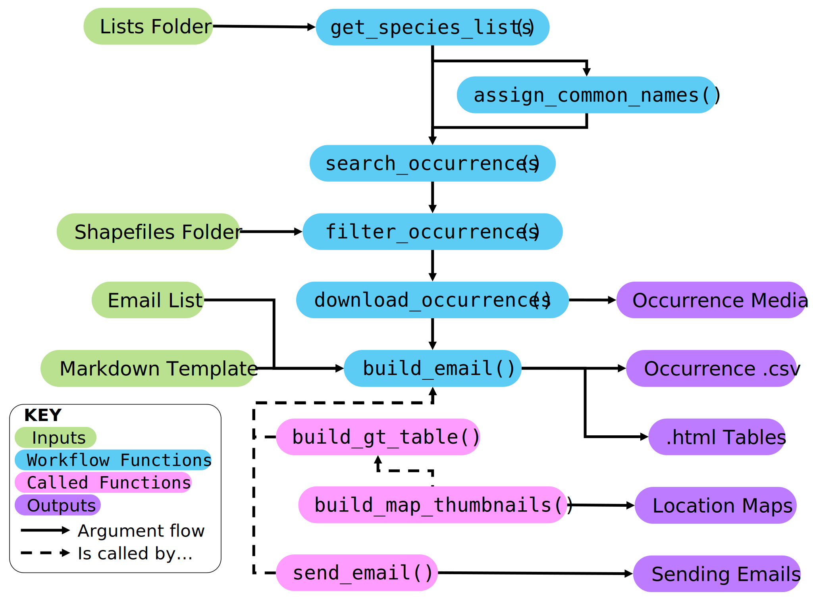

# koel

`koel` provides a workflow to facilitate the process of searching for taxa within spatial and temporal constraints, summarising this information in a table, and sending the table as an email. `koel` uses the [`galah`](https://galah.ala.org.au) package to query biodiversity data within the [Atlas of Living Australia](https://www.ala.org.au) (ALA), and the [`emayili`](https://github.com/datawookie/emayili/) package to send emails from R. `koel` is developed and maintained by the [Science and Decision Support Team](https://labs.ala.org.au/about.html) at the ALA. 

The package is named after the Eastern Koel (*Eudynamys orientalis*), a large, canopy-dwelling cuckoo with [distinctive calls](https://xeno-canto.org/explore?query=Eudynamys%20orientalis). 


## Installation

Install the package from GitHub:

``` r
install.packages("remotes")
remotes::install_github("atlasoflivingaustralia/koel")
```


## Workflow

The figure below provides an overview of the suggested workflow when using `koel`. Users provide a csv file containing taxon information, and the filepath to this is passed as an argument to the first function in the suggested workflow, `collate_lists()`. This summarises the information provided in the species list(s), and the subsequent functions pass the species names through a series of filtering, checking, and downloading steps to produce a tibble containing information on the requested species. 




### Taxonomic information

Taxonomic information is provided as one or more csv files, where each species is listed on a separate row. The following four columns must be included: `"correct_name"`, `"provided_name"`, `"synonyms"`, `"common_name"`

  - `"correct_name"` is the accepted scientific name of a species e.g. `"Urodynamis taitensis"`. The correct name should not contain authorities, commas, or double spaces.
    
  - `"provided_name"` is the verbatim name of the species as provided for the list e.g. `"Urodynamis taitensis (Sparrman, 1787)"`. It is not used when searching for species occurrences and may be identical to `"correct_name"` or `"common_name"`.
    
  -  `"synonyms"` is a comma-delimited string of additional search terms for each species e.g. `"Urodynamis taitensis belli, Cuculus taitensis, Eudynamis taitensis"`. The naming convention for `synonyms` is identical to that described for `correct_name`. This field may be left blank.
    
  -  `"common_name"` is the common name of the species e.g. `"Long-Tailed Koel"`. This field may be left blank.


### Spatial filters

By default, `koel` retrieves Australia-wide species occurrence records from the ALA. It is possible to filter records to particular spatial regions by including any of the following optional columns in the provided csv files: `"state"`, `"lga"`, `"shape"`

  - `"state"` is a comma-delimited string of Australian states and/or territories e.g. `"QLD, SA, NT"`. Standard upper case initialisms, abbreviations, and contractions (QLD, NSW, VIC, SA, WA, NT, ACT) are used. If the abbreviation `"AUS"` is provided, or if this field is left blank, no state-based spatial filters will be applied. This may be useful if it is necessary to search for records from island territories e.g. Norfolk Island, Christmas Island.
  
  -  `"lga"` is a comma-delimited string of Australian local government areas (LGAs), provided in upper case e.g. `"CITY OF PERTH, KANGAROO ISLAND COUNCIL"`. The full list of LGA names is available through the ALA as a contextual layer (cl10923). This may be accessed through the [spatial portal](https://spatial.ala.org.au) or using the `galah` package. 
 
``` r
# view LGA names
galah::search_fields("cl10923") |>
  galah::show_values()
```

  - `"shape"` is the filepath to a shapefile (.shp) within a directory containing other associated spatial files (e.g. .shx, .dbf, .prj). Multiple feature shapes may be provided within a single shapefile. Records will be filtered to those falling within the shapefile(s). Where multiple feature shapes are provided, the name of the feature matching to the record location will be provided in the final html table. 


### Sending an email

The email summarising the results of this workflow contains a table that includes information on each species of interest, details of each observation, a map thumbnail of each location, and an image (if available) of each species. 

to do this, users have to provide an rmd file. we recommend doing this by taking the tibble output from download occurrences and rendering a table using gt like this:

code code code

this then goes into the rmd template, which is saved as a html file, that is rendered in the email

sending an email is done through the send_email() function and users need to supply values for the `host` and `port` arguments. alternatively, the rendered html table can be saved ... 

 

Emails are sent using the R package `{emayili}` and require the provision of an email address and password in the `build_email()` and `send_email()` functions. Currently there is only support for emails such as the official ALA biosecurity alerts email which can be interfaced with the `emayili::server()` function by way of the `host` and `port` arguments.

The email sending functions utilise an R Markdown template to create a summary document of all species occurrences. This template should be created and saved by the user in the working directory prior to use of the function. `build_email()` requests an argument specifying the path to the template and renders + saves the .Rmd file in-line. The object provided to the template is a data.frame named `table_df` and we recommended using package `{gt}` to render the dataframe.

`table_df` consists of one row per row occurrence, and four columns (`species`, `observation`, `location`, `image`) of html code referencing data and media related to each occurrence. A recommended output style within the markdown using `{gt}` may look something like this:

``` r
table_df |>
  gt::gt() |>
  gt::cols_label(
    species = "Species",
    observation = "Observation",
    location = "Location",
    image = "Image"
  ) |>
  gt::cols_align(align = c("left"), columns = everything()) |>
  gt::tab_options(table.width = pct(90))
```

`build_email()` requires the provision of a data.frame for the `email_list` argument. However, if the user wishes to simply save the .html occurrence tables than the `email_list` argument can be provided as an empty dataframe with the necessary columns i.e. `email_list <- data.frame(email = character(), list = character())`. By then specifying an output folder path (default value of `output_path` argument is `NULL`, the rendered markdown files will be saved to that directory without sending any emails.


### Multiple input files

Users may provide multiple csv files as inputs. In these cases, all files must be located in the same directory. The html tables resulting from the searching and filtering process are grouped by lists, so providing multiple lists results in multiple html tables being produced. Thus providing multiple lists may be useful if it is necssary to group species into different tables, or if tables are to be emailed to different addresses. 
